

  <!--  -->
  
  <!--  -->
  
  

  🌍
  中文 |
  <a href="./README_EN.md">English</a> |
  <a href="./README_JA.md">日本語</a>

  📥
  <a href="#-快速开始">快速开始</a> |
  <a href="#-功能">功能一览</a>

# UE Arknights Endfield NPR - UE 仿终末地卡通渲染
这是使用 `Unreal Engine 5.8` 开发的渲染工程，以还原《明日方舟：终末地》的画面风格为目标。  
风格是 **`PBR` 与 `NPR` 结合**：衣物、场景等物体采用更接近 `PBR` 的写实渲染，突出纹理细节和物理质感。  
角色的 **面部、皮肤、头发** 等则采用更接近 `NPR` 的卡通渲染，二者在同一画面中协调统一。  
效果基于 `材质编辑器` 与 `后处理材质` 实现，按角色部位拆分材质，可直接在编辑器内查看与调整。  

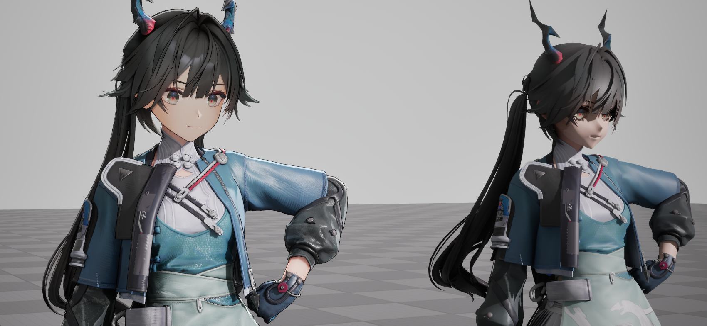

> ⚠️ **本文件为第一版**，各材质的具体实现与参数说明待补充。

## 📜 目录
- [💻 运行环境](#-运行环境)
- [🌱 快速开始](#-快速开始)
- [✨ 功能](#-功能)
  - [Skin 皮肤](#skin-皮肤)
  - [Cloth 衣服](#cloth-衣服)
  - [Face 脸部](#face-脸部)
  - [Hair 头发](#hair-头发)
  - [Eye 眼睛](#eye-眼睛)
  - [Brow 眉毛](#brow-眉毛)
  - [Outline 外描边](#outline-外描边)
  - [Rim Light 等距边缘光](#rim-light-等距边缘光)
  - [MaterialFunction 材质函数](#materialfunction-材质函数)
  - [Scene 场景与角色](#scene-场景与角色)
- [🗺️ 开发进度](#️-开发进度)
- [📄 许可证](#-许可证)

## 💻 运行环境
| 项目 | 版本 |
| :-- | :-- |
| Unreal Engine | `5.8` |
| 许可证 | GPL-3.0 |

## 🌱 快速开始
1. 使用 `Unreal Engine 5.8` 打开 `ArknightsEndfieldNRP.uproject`。
2. 首次打开会编译着色器，请耐心等待。
3. 打开默认关卡 `Content/Levels/M_Main`，即可看到角色渲染效果。

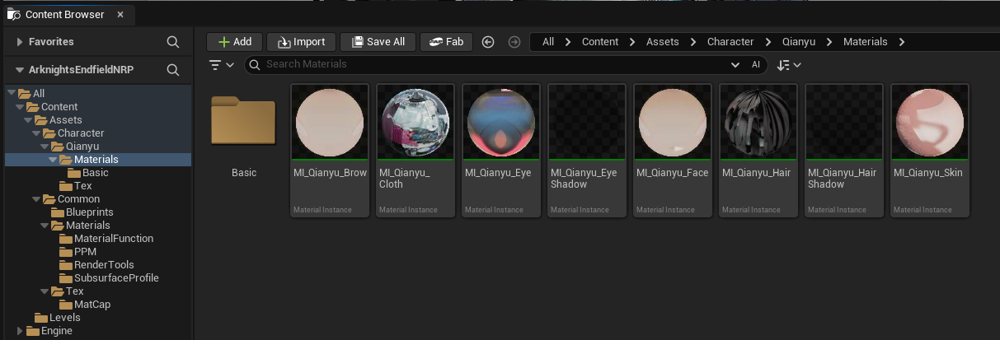

## ✨ 功能
---
材质采用 `父材质（M_*）+ 材质实例（MI_*）` 的分层结构，按角色部位拆分为独立材质。
各部位按风格倾向分为 **`NPR`（角色面部、皮肤、头发等）** 与 **`PBR`（衣物、场景等）** 两类。

---

### Skin 皮肤
`NPR` 角色皮肤材质。

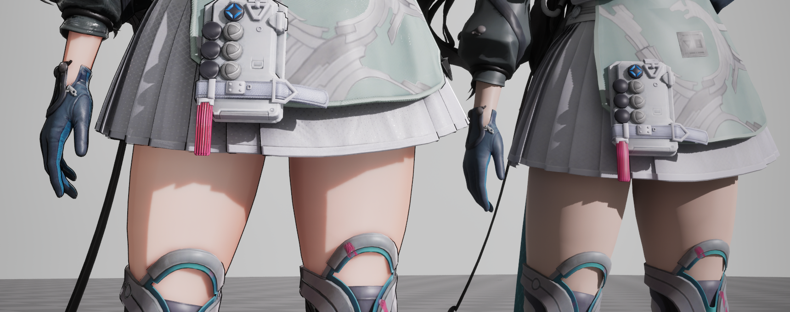

---

### Cloth 衣服
`PBR` 衣服材质，包含基础颜色与 **褶皱** 表现。

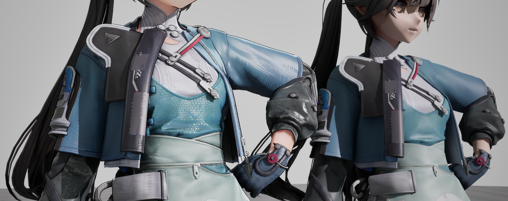

---

### Face 脸部
脸部使用独立材质，NPR风格渲染。

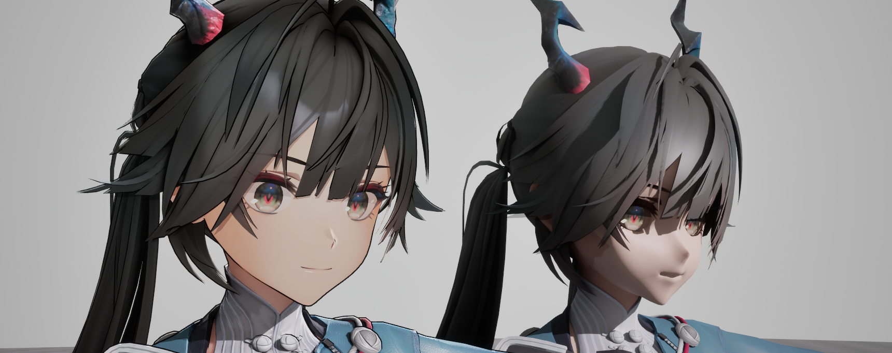

---

### Hair 头发
头发材质包含基础颜色与阴影，并在此基础上加入了 **高光** 与 **顶部打光**。
高光使用 `MatCap` 和 `Kajiya-Kay` 模型实现。

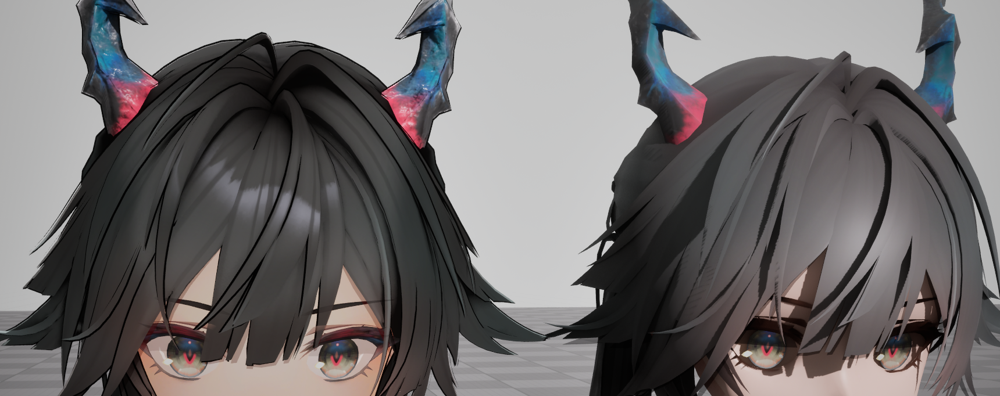

另有独立的 **头发阴影材质**。

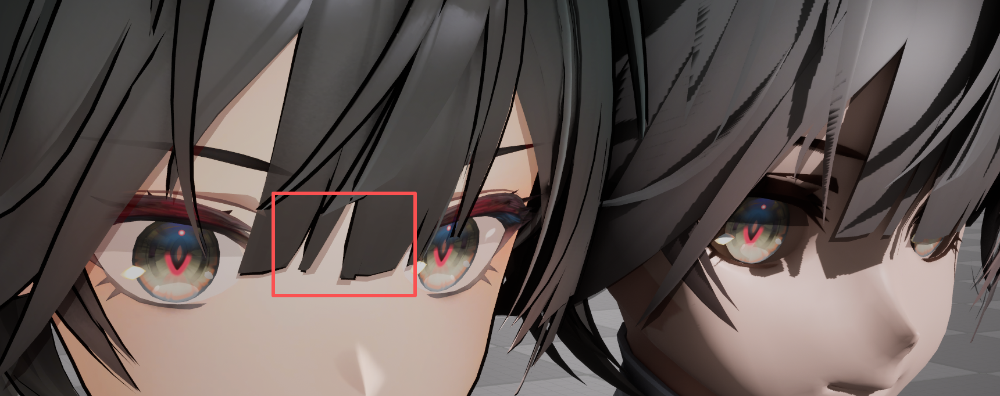

---

### Eye 眼睛
眼睛材质实现了 **视差效果**。

另有独立的 **眼睛阴影材质**。

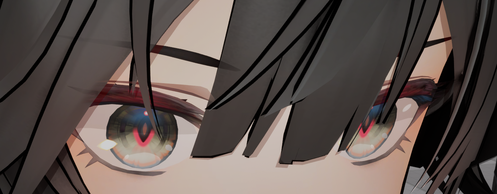

---

### Brow 眉毛
眉毛材质实现了 **透过头发显示** 的效果。

---

### Outline 外描边
**基于顶点法线** 实现的外描边材质。

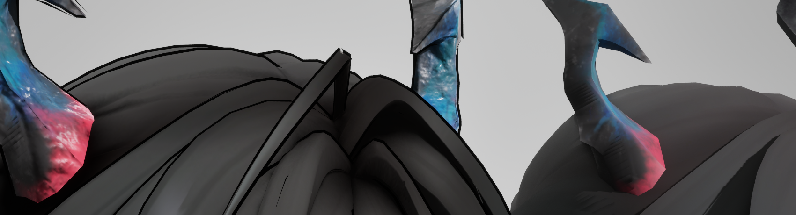

---

### Rim Light 等距边缘光
以后处理材质实现的 **等距边缘光**。配合工程中已启用的 **自定义深度模板（Custom Depth Stencil）**。

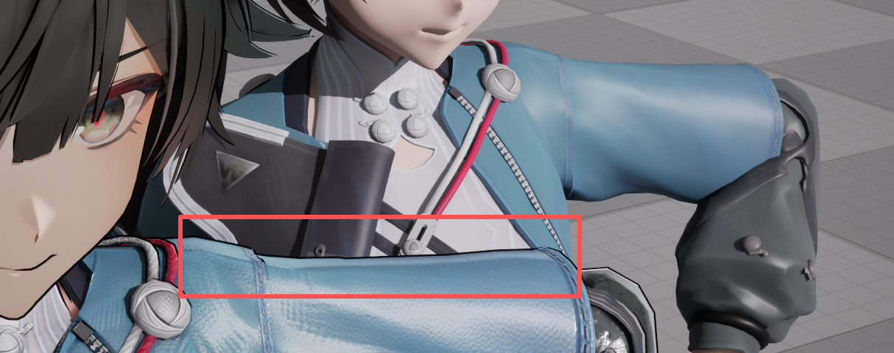

---

### MaterialFunction 材质函数
通用逻辑抽取为材质函数，供各部位材质复用。

| 函数 | 说明 |
| :-- | :-- |
| MF_UnpackNormalXY | 法线解包 |
| MF_ColorBlend | 颜色混合 |
| MF_MaskAdjust | 遮罩调整，用于快速对计算得出的 Scalar 值进行 Smooth(缩放) 和 Offset(偏移) |
| MF_Rim | 等距边缘光计算，内部结合了 MF_MaskAdjust 参数，可以快速计算获取边缘光并调整，然后应用于需要的计算场景中。 |

---

### Scene 场景与角色
- 角色已配置动画。
- 场景内放置了 **白模角色** 用于与渲染效果做直观对比。
- 主关卡为 `Content/Levels/M_Main`。

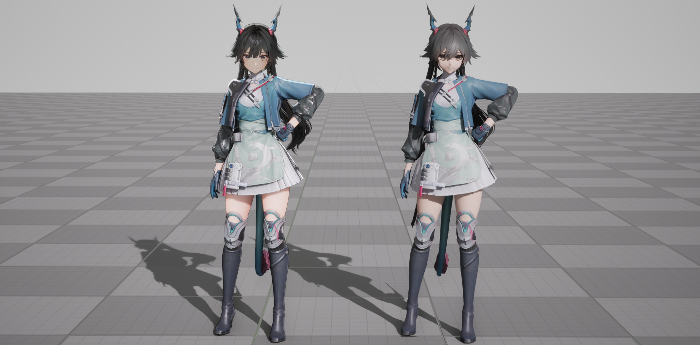

---

## 🗺️ 开发进度

| 部位 / 功能 | 状态 |
| :-- | :--: |
| 皮肤 Skin | ✅ |
| 衣服 Cloth（褶皱） | ✅ |
| 脸部 Face | ✅ |
| 头发 Hair（高光、顶部打光、阴影） | ✅ |
| 眼睛 Eye（视差、眼影） | 🚧 |
| 眉毛 Brow（透过头发） | ✅ |
| 外描边 Outline（顶点法线） | ✅ |
| 等距边缘光 Rim Light（后处理） | ✅ |
| 角色动画与场景布局 | ✅ |
| 材质参数文档化 | 🚧 |
| 效果图与演示 | 🚧 |
